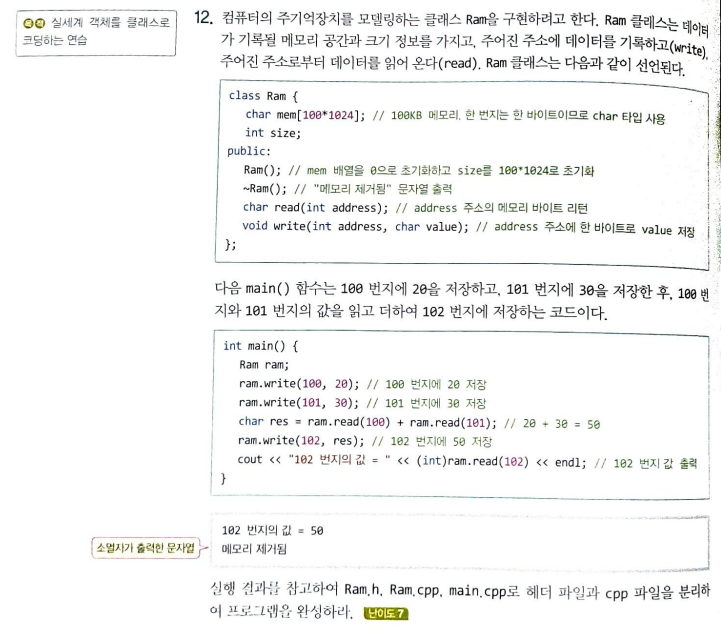
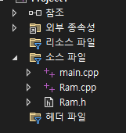
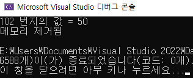

# hw#1

#과제 내용

교제 P156 의 12번 문제를 프로그래밍하여 제출 하시오.

### 교제 p156 - 12번



### 실제 폴더 구조



### 실행결과



### 소스파일

main.cpp

```cpp
#include <iostream>
#include "Ram.h"
using namespace std;

int main() {
	Ram ram;
	ram.write(100, 20);
	ram.write(101, 30);
	char res = ram.read(100) + ram.read(101); // 20 + 30 = 50
	ram.write(102, res);
	cout << "102 번지의 값 = " << (int)ram.read(102) << endl;
	
}
```

Ram.cpp

```cpp
#include <iostream>
using namespace std;
#include "Ram.h" 

Ram::Ram()
{
}

Ram::~Ram() {
	cout << "메모리 제거됨" << endl;
}

char Ram::read(int address)
{
	return mem[address];
}

void Ram::write(int address, char value)
{
	mem[address] = value;
}
```

Ram.h

```cpp
class Ram {
	char mem[100 * 1024];
	int size;
public:
	Ram();
	~Ram();
	char read(int address);
	void write(int address, char value);

};
```