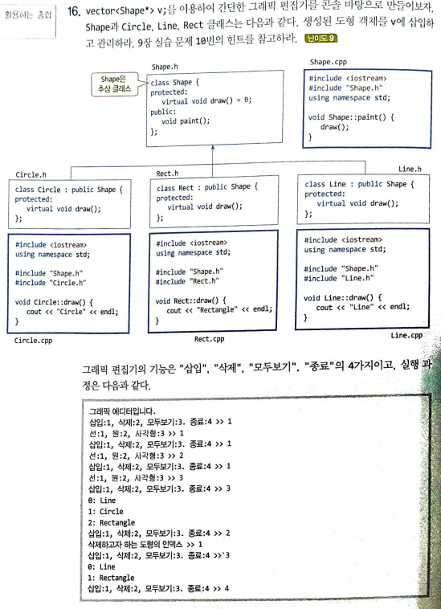

# hw#3

#과제 내용

교제 **P532 의 16번** 문제를 프로그래밍하여 제출 하시오.

### 교제 p532 - 16번



### 폴더 구조


### 코드:

FileName.cpp

```cpp
#include <iostream>
#include <vector>
#include "Shape.h"
#include "Circle.h"
#include "Line.h"
#include "Rect.h"

using namespace std;

int main() {
	vector<Shape*> v;
	int n;
	cout << "그래픽 에디터입니다." << endl;
	while (true)
	{
		cout << "삽입:1, 삭제:2, 모두보기:3, 종료:4 >> ";
		cin >> n;
		if (n == 1) {
			cout << "선: 1, 원:2, 사각형:3 >> ";
			cin >> n;
			switch (n) {
			case 1: v.push_back(new Line); break;
			case 2: v.push_back(new Circle); break;
			case 3: v.push_back(new Rect); break;
			}
		}
		else if (n == 2) {
			cout << "삭제하고자 하는 도형의 인덱스 >> ";
			cin >> n;
			vector<Shape*>::iterator it = v.begin();
			it += n;
			it = v.erase(it);
		}
		else if (n == 3) {
			for (int i = 0; i < v.size(); i++) {
				cout << i << " : ";
				v[i]->paint();
			}
		}
		else if (n == 4) break;

	}
}
```

Shape.h

```cpp
#ifndef SHAPE_H
#define SHAPE_H
class Shape {
protected:
    virtual void draw() = 0;
public:
    void paint();
};
#endif
```

Shape.cpp

```cpp
#include <iostream>
#include "Shape.h"
using namespace std;
void Shape::paint() {
    draw();
}
```

Rect.h

```cpp
#include "Shape.h"

class Rect : public Shape {
protected:
    virtual void draw();
};
```

Rect.cpp

```cpp
#include <iostream>
using namespace std;
#include "Shape.h"
#include "Rect.h"
void Rect::draw() {
    cout << "Rectangle" << endl;
}
```

Line.h

```cpp
#include "Shape.h"

class Line : public Shape {
protected:
    virtual void draw();
};
```

Line.cpp

```cpp
#include <iostream>
using namespace std;
#include "Shape.h"
#include "Line.h"
void Line::draw() {
    cout << "Line" << endl;
}
```

Circle.h

```cpp
#include "Shape.h"

class Circle : public Shape {
protected:
    virtual void draw();
};
```

Circle.cpp

```cpp
#include <iostream>
using namespace std;
#include "Shape.h"
#include "Circle.h"
void Circle::draw() {
    cout << "Circle" << endl;
}
```

결과:

