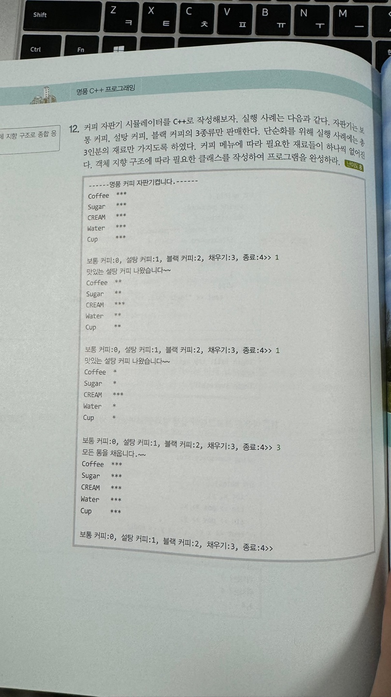

# hw#4

#과제 내용

교제 **P586 의 12번** 문제를 프로그래밍하여 제출 하시오.



### 코드:

main.cpp

```cpp
#include <iostream>

class CoffeeVendingMachine {
private:
    int coffee;
    int sugar;
    int cream;
    int water;
    int cup;

public:
    CoffeeVendingMachine() : coffee(3), sugar(3), cream(3), water(3), cup(3) {}

    void displayStatus() {
        std::cout << "---------명품 커피 자판기 켭니다.-----------" << std::endl;
        std::cout << "Coffee ";
        for (int i = 0; i < coffee; ++i)
            std::cout << "*";
        std::cout << std::endl;

        std::cout << "Sugar ";
        for (int i = 0; i < sugar; ++i)
            std::cout << "*";
        std::cout << std::endl;

        std::cout << "CREAM ";
        for (int i = 0; i < cream; ++i)
            std::cout << "*";
        std::cout << std::endl;

        std::cout << "Water ";
        for (int i = 0; i < water; ++i)
            std::cout << "*";
        std::cout << std::endl;

        std::cout << "Cup ";
        for (int i = 0; i < cup; ++i)
            std::cout << "*";
        std::cout << std::endl;
    }

    void makeCoffee(int choice) {
        switch (choice) {
        case 0:
            if (coffee > 0 && water > 0 && cup > 0) {
                std::cout << "보통 커피 나왔습니다~~" << std::endl;
                coffee--;
                water--;
                cup--;
            }
            else {
                std::cout << "재료가 부족합니다." << std::endl;
            }
            break;
        case 1:
            if (coffee > 0 && sugar > 0 && water > 0 && cup > 0) {
                std::cout << "맛있는 설탕커피 나왔습니다~~" << std::endl;
                coffee--;
                sugar--;
                water--;
                cup--;
            }
            else {
                std::cout << "재료가 부족합니다." << std::endl;
            }
            break;
        case 2:
            if (coffee > 0 && water > 0 && cup > 0) {
                std::cout << "블랙커피 나왔습니다~~" << std::endl;
                coffee--;
                water--;
                cup--;
            }
            else {
                std::cout << "재료가 부족합니다." << std::endl;
            }
            break;
        case 3:
            coffee = sugar = cream = water = cup = 3;
            std::cout << "모든 통을 채웁니다.~~" << std::endl;
            break;
        case 4:
            std::cout << "종료합니다." << std::endl;
            break;
        default:
            std::cout << "잘못된 선택입니다." << std::endl;
        }
    }
};

int main() {
    CoffeeVendingMachine vendingMachine;

    int choice = -1;
    while (choice != 4) {
        vendingMachine.displayStatus();

        std::cout << "보통 커피:0, 설탕 커피:1, 블랙 커피:2, 채우기:3, 종료:4>> ";
        std::cin >> choice;

        vendingMachine.makeCoffee(choice);
    }

    return 0;
}
```

결과:

